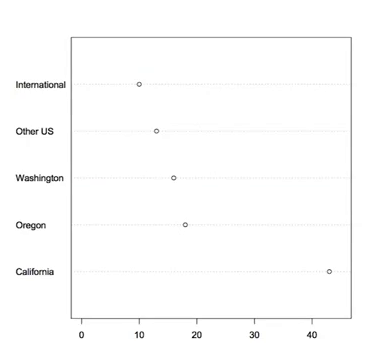
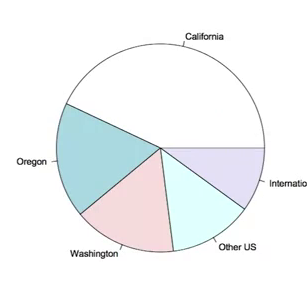
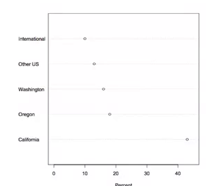
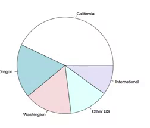
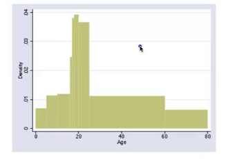
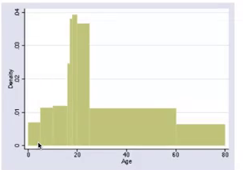
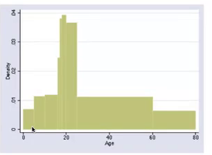
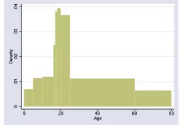

Markdown
========

# sample.mp4 OCR

## page 1

### Graphical summaries of data

- It is best to use a graphical summary to communicate information, because people prefer to look at pictures rather than at numbers. 

## page 2

### Pie chart and dot plot
  
  

## page 3

### Pie chart and dot plot
  
  

- The dot plot makes it easier to compare frequencies of various categories, while the pie chart allows more easily to eyeball what fraction of the total a category corresponds t 

## page 4

### Bar graph

- When the data are quantitative (i.e. numbers), then they should be put on a number line. This is because the ordering and the distance between the numbers convey 
- important information. 

## page 5

### The histogram
  

## page 6

### The histogram gives two kinds of information about the data:
  

1. Density (crowding): The height of the bar tells how many subjects there are for one unit on the horizontal scale. 

## page 7

### The histogram gives two kinds of information about the data:
  

1. Density (crowding): The height of the bar tells how many subjects there are for one unit on the horizontal scale. For example, the highest density is around age 19 as 
- each one year range for ages 60-80. 

## page 8

## page 9

### :
  
  

- area = height x width. 

# sample.mp4 STT

testing / we are testing this system. Is this work?